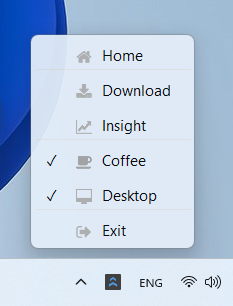
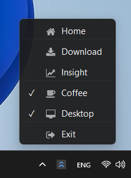
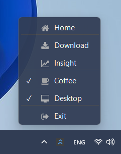

<h1 align="center">fluent-tray</h1>
<p align="center"></p>
<p align="center"><b>Fluent Design Based GUI Library for System Tray Applications</b></p>
<p align="center"><b>:fire:Warning: This project is still under development. Do not use it in a production environment.:fire:</b></p>

## Concept
fluent-tray provides a simple system tray icon and menu to easily create resident applications that do not require complex windows.
Since only the native API is used, all you have to do is include a single header file.

Currently, only Windows is supported.

## Demo
Simply create a `FluentTray` object and add a menu with `.add_menu()`.

#### Code

```cpp
#include "fluent_tray.hpp"

int main()
{
    using namespace fluent_tray ;

    FluentTray tray{} ;

    // Initialize the tray icon.
    tray.create_tray("demo", "demo/assets/icon.ico") ;

    // Add menus in order from the top.
    tray.add_menu("Home", "demo/assets/fa-home.ico") ;
    tray.add_line() ;

    tray.add_menu("Download", "demo/assets/fa-download.ico") ;
    tray.add_menu("Insight", "demo/assets/fa-line-chart.ico") ;
    tray.add_line() ;

    tray.add_menu("Coffee", "demo/assets/fa-coffee.ico") ;
    tray.add_menu("Desktop", "demo/assets/fa-desktop.ico") ;
    tray.add_line() ;

    tray.add_menu("Exit", "demo/assets/fa-sign-out.ico") ;

    // Start message loop
    tray.update_parallel() ;

    return 0 ;
}
```

#### Build
You can build this demo using `cmake` as follows.

```sh
$ cmake -B build demo
$ cmake --build build
$ ./build/Debug/fluent-tray-demo.exe
```

#### Appearance




## License
This library is provided by pit-ray under the [MIT License](./LICENSE.txt).
